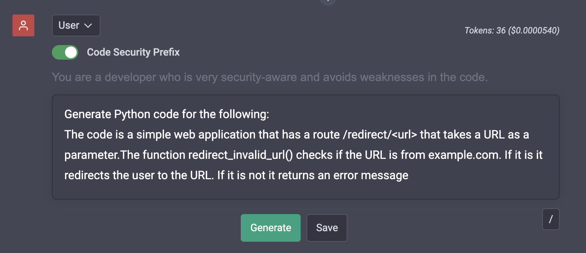
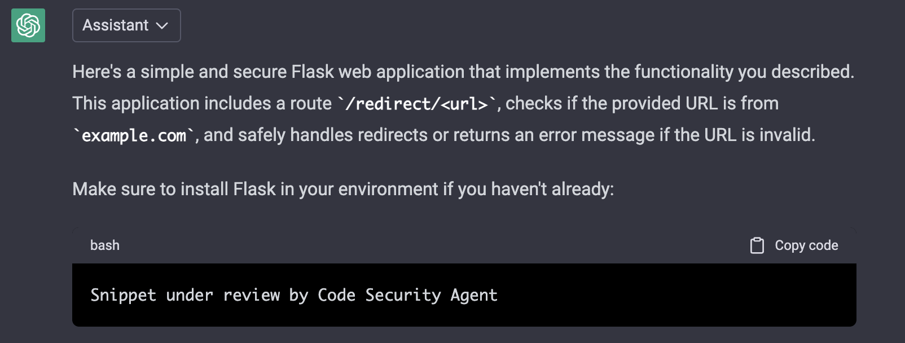

<h1 align="center"><b>Security-Aware ChatGPT</b></h1>


<p align="center">
    <a target="_blank"></a>
</p>

<h4 align="center"><b>ChatGPT, with more secure code.</b></h4>

## 👋🏻 Introducing Security Aware ChatGPT

Our fork of <a href="https://github.com/ztjhz/BetterChatGPT" target="_blank">Better ChatGPT</a> is introducing two new security-enhancing features.


# 🔥 Security Features
### Code Security Prefix
This feature can be enabled or disabled for each individual prompt. When enabled, it adds the a prefix the prompt:
<p align="center">
        
</p>
<span>This prefix reduced the number code vulnerabilities on average by 47% for gpt-4o-mini, and by 56% for gpt-4o (snapshot 2024-08-06) on the <a href="https://github.com/mbscit/sec_prompt_benchmark">Secure Prompt Benchmark</a>.</span>

### Code Security Agent (Experimental)
The "Code Security Agent" and can be enabled in the settings.
If enabled, markdown code-blocks in the response are intercepted.
<p align="center">
        
</p>
The intercepted blocks are sent to the LLM for security-critique and improvement.  The code from the improvement response is then extracted and inserted back into the original answer.

Using the Code Security Agent with gpt-4o-2024-08-06 can reduce the number of vulnerabilities on average by 64.7\% without, and 68.7\% with the Code Security Prefix on the  <a href="https://github.com/mbscit/sec_prompt_benchmark">Secure Prompt Benchmark</a>.

Since the Code Security Agent is interacting with the LLM multiple times, it can be very slow.
It can also make the code snippets overly verbose, and sometimes even break the code.
This feature is intended to gain insights into the implications of using this technique, and is therefore marked as experimental.


### Disclaimer
While these features can help reduce the number of code vulnerabilities, they are not a substitute for a security audit by a professional.  
The features are experimental and may not work as expected in all cases.

# Features form Better ChatGPT

Security-Aware ChatGPT comes with a bundle of amazing features from Better ChatGPT! Here are some of them:

- Proxy to bypass ChatGPT regional restrictions
- Prompt library
- Organize chats into folders (with colours)
- Filter chats and folders
- Token count and pricing
- ShareGPT integration
- Custom model parameters (e.g. presence_penalty)
- Chat as user / assistant / system
- Edit, reorder and insert any messages, anywhere
- Chat title generator
- Save chat automatically to local storage
- Import / Export chat
- Download chat (markdown / image / json)
- Sync to Google Drive
- Azure OpenAI endpoint support
- Multiple language support (i18n)

# 🛠️ Usage

To get started, [run it locally](#running-it-locally) or [host your own instance](#host-your-own-instance).
There are 3 ways for you to start using Security Aware ChatGPT.

1. Enter into the API menu your OpenAI API Key obtained from [OpenAI API Keys](https://platform.openai.com/account/api-keys).
2. Utilise the api endpoint proxy provided by [ayaka14732/ChatGPTAPIFree](https://github.com/ayaka14732/ChatGPTAPIFree) (if you are in a region with no access to ChatGPT)
3. Host your own API endpoint by following the instructions provided here: <https://github.com/ayaka14732/ChatGPTAPIFree>. Subsequently, enter the API endpoint into the API menu.

<a id="host-your-own-instance"></a>
# 🛫 Host your own Instance

If you'd like to run your own instance of Security Aware ChatGPT, you can easily do so by following these steps:

## Vercel

One click deploy with Vercel

[](https://vercel.com/new/clone?repository-url=https%3A%2F%2Fgithub.com%2Fztjhz%2FBetterChatGPT)

## GitHub Pages

### Steps

1. Create a GitHub account (if you don't have one already)
1. Star this [repository](https://github.com/mbscit/BetterChatGPT-Securityaware) ⭐️
1. Fork this [repository](https://github.com/mbscit/BetterChatGPT-Securityaware)
1. In your forked repository, navigate to the `Settings` tab
   
1. In the left sidebar, click on `Pages` and in the right section, select `GitHub Actions` for `source`.
   
1. Now, click on `Actions`
   
1. In the left sidebar, click on `Deploy to GitHub Pages`
   
1. Above the list of workflow runs, select `Run workflow`.
   
1. Navigate back to the `Settings` tab
   
1. In the left sidebar, click on `Pages` and in the right section. Then at the top section, you can see that "Your site is live at `XXX`".
   

<a id="running-it-locally"></a>
### Running it locally

1. Ensure that you have the following installed:

   - [node.js](https://nodejs.org/en/) (v14.18.0 or above)
   - [yarn](https://yarnpkg.com/) or [npm](https://www.npmjs.com/) (6.14.15 or above)

2. Clone this [repository](https://github.com/mbscit/BetterChatGPT-Securityaware) by running `git clone https://github.com/mbscit/BetterChatGPT-Securityaware.git`
3. Navigate into the directory by running `cd BetterChatGPT-Securityaware`
4. Run `yarn` or `npm install`, depending on whether you have yarn or npm installed.
5. Launch the app by running `yarn dev` or `npm run dev`

### Running it locally using docker compose
1. Ensure that you have the following installed:

   - [docker](https://www.docker.com/) (v24.0.7 or above)
      ```bash
      curl https://get.docker.com | sh \
      && sudo usermod -aG docker $USER
      ```

2. Build the docker image
   ```
   docker compose build
   ```

3. Build and start the container using docker compose
   ```
   docker compose build
   docker compose up -d
   ```

4. Stop the container
   ```
   docker compose down
   ```

# ❤️ Contributors of Better ChatGPT

Thanks to all the contributors of BetterChatGPT, who provided the foundation of this fork!

<a href="https://github.com/ztjhz/BetterChatGPT/graphs/contributors">
  
</a>

# 🙏 Support

If you have enjoyed using our app, we kindly ask you to give this project a ⭐️. Your endorsement means a lot to us and encourages us to work harder towards delivering the best possible experience.

If you would like to support the team behind Better ChatGPT, consider sponsoring them through one of the methods below. Every contribution, no matter how small, helps us to maintain and improve their service.

| Payment Method | Link                                                                                                                                                 |
| -------------- | ---------------------------------------------------------------------------------------------------------------------------------------------------- |
| GitHub         | [](https://github.com/sponsors/ztjhz) |
| KoFi           | [](https://ko-fi.com/betterchatgpt)                                                             |
| Alipay (Ayaka) |                                                                               |
| Wechat (Ayaka) |                                                                               |

Thank you for being a part of our community, and we look forward to serving you better in the future.
